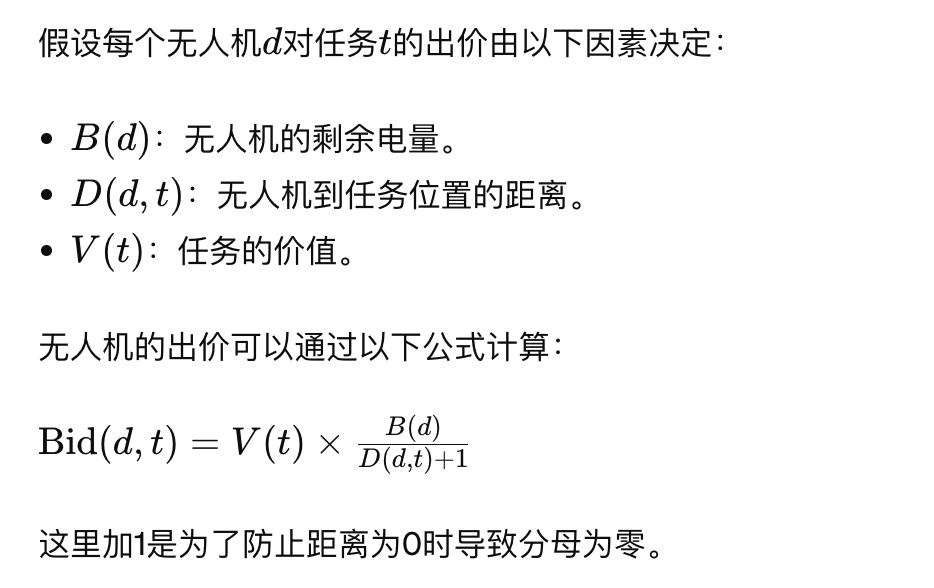

## 竞价模型

竞价模型是一种市场机制，可用于动态任务分配，特别是在多无人机系统中。该模型允许无人机根据任务的价值和自身的能力进行竞争，从而实现有效的资源分配。以下是一个基于竞价的任务分配模型的简单示例：

在这个模型中，每个任务都有一个“价值”（或紧急程度），无人机需要根据自己的资源状况（如电量、距离任务的距离、当前负载）对任务进行出价。出价最高的无人机将获得该任务。这种机制鼓励无人机根据其实际能力和任务的重要性来决定是否参与竞争。

### 模型组件

1. **任务价值**：每个任务有一个基本价值，可以根据任务的紧急程度、复杂性或对完成时间的要求来设定。
2. **无人机资源**：包括电量、速度、当前位置和未来一段时间内的可用性。
3. **出价函数**：每个无人机根据其资源状况和任务价值计算出一个出价。

1. **发布任务**：系统将任务和它们的价值发布给所有无人机。
2. **计算出价**：每个无人机根据自身资源和任务价值计算出价。
3. **提交出价**：无人机将其出价提交给中央系统。
4. **任务分配**：中央系统根据收到的出价，选择出价最高的无人机分配任务。
5. **执行任务**：获得任务的无人机执行任务，并在完成后更新其资源状态。

- 动态适应：无人机根据当前状态动态决定竞争任务，增强系统的适应性。
- 资源优化：通过竞争确保最合适的无人机执行任务，优化资源利用。

- 计算开销：每个任务发布都需要无人机计算和提交出价，增加了计算和通信负担。
- 可能的非最优分配：在某些情况下，简单的出价策略可能不会导致最优资源利用，特别是在出价函数不完全代表实际操作效率时。

## Wall-Around算法

## 路径规划

https://blog.csdn.net/weixin_43793717/article/details/137238772?spm=1001.2014.3001.5502
https://blog.csdn.net/weixin_43793717/article/details/137262469

## LPA* 算法

## D* Lite 算法

https://blog.csdn.net/lqzdreamer/article/details/85108310

## 模糊逻辑

模糊逻辑:根据条件，不单纯的给出是否，而是给出一个隶属度权重的算法。通常用于避免AI在参数边缘上的抖动。

移动失败后将一些点设为不可到达点，方便基地去分析

有一部分无人机要在原地待命

要防止区域复燃（所以如果区域里的火复燃了就给惩罚）

## 动态任务分配逻辑

- **任务类型**：
  - 探索任务：识别尚未探测的区域。
  - 灭火任务：定位并扑灭已知火源。
- **无人机角色**：
  - 探索无人机：优先分配探索任务。
  - 灭火无人机：优先分配灭火任务。

#### 初始化任务区域

- **探索区域**：从 `memory_grid` 中识别所有标记为 `Objects.Unseen` 的单元格。
- **火源区域**：从 `memory_grid` 中识别所有标记为 `Objects.Fire` 的单元格。

1. **计算可分配任务**：
   - 使用 `numpy.argwhere` 获取各任务类型的坐标索引。
2. **循环遍历所有无人机**：
   - 对于每个无人机，根据其角色和可用的任务类型进行任务分配。
   - 确保每个任务类型至少尝试分配给一个对应角色的无人机。
3. **任务分配**：
   - 如果是探索无人机且探索区域有未分配的任务，分配探索任务。
   - 如果是灭火无人机且火源区域有未分配的任务，分配灭火任务。
   - 如果无人机的角色对应的任务已全部分配，尝试分配另一类型的任务。
   - 如果所有任务已分配完毕，发送清除任务的指令，允许无人机自由行动。
4. **计算任务区域边界**：
   - 对于每个分配的任务，计算该任务的最小和最大坐标，形成任务区域的矩形边界。
5. **发送任务消息**：
   - 创建并发送包含任务边界的 `MoveToAreaMessage`。

